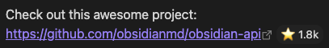

# GitHub Stars Plugin

An Obsidian plugin that automatically displays GitHub star counts next to repository links in your notes — in both Reading View and Live Preview. Star counts can also be embedded directly into your markdown, making them visible outside Obsidian.

## ✨ Features

- Automatically detects GitHub repository URLs in your notes
- Displays the star count next to each GitHub repository link in both **Reading View** and **Live Preview**
- Embed star counts directly into your markdown files so they are **visible outside Obsidian**
- Caches star counts to minimize API requests
- Optional GitHub API token support for higher rate limits
- Supports abbreviated number formatting (e.g., 1.2k instead of 1,234)
- Commands to refresh, embed, and remove star counts

## 📸 Examples

When you include a GitHub repository URL in your notes, the plugin will automatically enhance it to show the star count:

  
_Star counts displayed inline next to GitHub repository links in Reading View._

## 📦 Installation

1. Open **Obsidian Settings** → **Community plugins**
2. Disable **Safe mode** if prompted
3. Click **Browse** and search for "GitHub Stars"
4. Click **Install**, then **Enable**

## ⚙️ Configuration

The plugin can be configured in the Settings tab:

- **Cache Expiry**: Time in minutes before the GitHub star count cache expires (default: 1440 minutes / 1 day)
- **Number Format**: Choose between full numbers (e.g., 1,234) or abbreviated format (e.g., 1.2k)
- **GitHub API Token**: Optional personal access token to increase the API rate limit from 60 to 5,000 requests per hour. To generate one:
    1. Go to [GitHub Settings > Developer settings > Personal access tokens](https://github.com/settings/tokens)
    2. Create a fine-grained personal access token or a classic token with access suitable for public repository metadata
    3. Give it a name and ensure it can access public repository metadata
    4. Click "Generate token"
    5. Copy the token and paste it in the plugin settings
- **Update embedded stars on refresh**: Enabled by default. When enabled, refreshing updates the star count written in the Markdown file next to a GitHub URL.
- **Show token warnings on refresh**: Enabled by default. When enabled, the plugin warns during manual refresh if the GitHub token is missing or invalid.

## 🔄 Refresh And Cache Behavior

- Rendering in Reading View and Live Preview uses cached star counts when the cache entry is still fresh.
- Cache expiry is lazy. When a cache entry expires, the plugin fetches new data the next time that repository is looked up. Expiry does not trigger a background refresh on its own.
- `Refresh for current note` is stronger than normal rendering. It fetches fresh star counts from GitHub for every repository in the active note even if those cache entries are still valid.
- If `Update embedded stars on refresh` is disabled, embedded star text is left unchanged and may show an older value than the refreshed star count.

## 💻 Commands

The plugin adds the following commands:

- **Refresh for current note**: Fetches fresh star counts from GitHub for all repositories in the current note and rerenders the note. If `Update embedded stars on refresh` is enabled, it also updates already-embedded star text.
- **Clear cache**: Clears the cached star counts
- **Embed star counts in current note**: Writes star counts (e.g. `⭐ 1.2k`) directly into the markdown file after each GitHub link. Re-running updates existing counts.
- **Remove embedded star counts from current note**: Strips all embedded star counts from the file

## 🧪 Development

- `npm test`: Runs the unit tests with Vitest
- `npm run build`: Type-checks and builds the plugin bundle

## ❤️ Support This Project

You can support this project in a few simple ways:

- ⭐ [Star the repo](https://github.com/flyingnobita/obsidian-github-stars)
- 🐛 [Report bugs](https://github.com/flyingnobita/obsidian-github-stars/issues)
- 💡 [Suggest features](https://github.com/flyingnobita/obsidian-github-stars/issues)
- 📝 [Contribute code](https://github.com/flyingnobita/obsidian-github-stars/pulls)

## 📄 License

[MIT](LICENSE) © Flying Nobita
